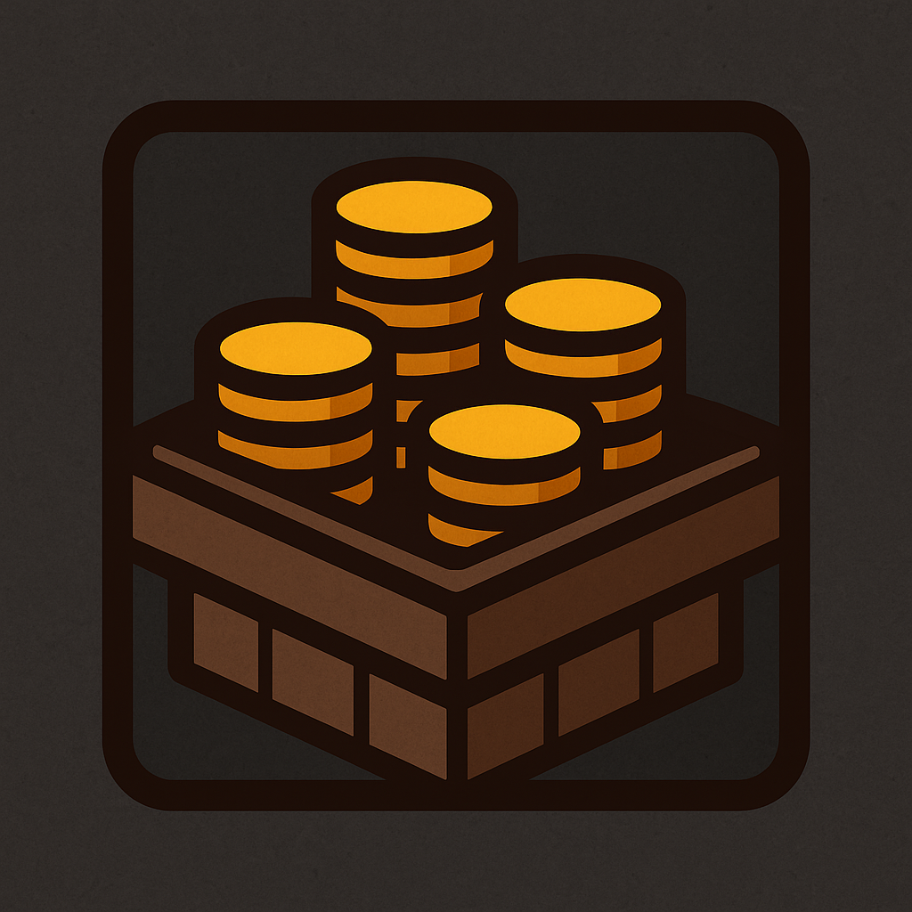

# Warband Stockist

Keeps chosen items and gold topped up across your characters using the Warband Bank.

[Join the Discord](https://discord.gg/87HRHcAYP)

## Features

- **Auto-withdraw.** Pulls items from the Warband Bank to match your configured stock when the bank opens.
- **Auto-deposit.** Optional. Moves excess items back to the Warband Bank, including any item set to a desired quantity of 0.
- **Profiles and assignments.** Create named profiles of items and assign one to each character. Ignored characters are listed separately and never auto-process.
- **Gold management.** Set a target gold amount per level bracket. Characters are automatically topped up or drained when the Warband Bank opens.
- **Per-character gold overrides.** Pin a specific gold target for a single character, taking priority over any bracket.
- **Stack-first placement.** Prefers merging into existing stacks before using empty slots, in both bags and bank.
- **Minimap button.** Quick access to settings. Left or right click to open, drag to move.

## Installation

Install from [CurseForge](https://www.curseforge.com/wow/addons/warband-stockist), or extract the addon folder into `World of Warcraft\_retail_\Interface\AddOns\`.

Requires: [Luckys_Utils](https://www.curseforge.com/wow/addons/luckys-utils) (bundled in the CurseForge release, install separately for manual installs).

## Usage

1. Open settings via the minimap button, the addon menu, or `/wbs settings`.
2. On the **Profiles** tab, create a profile and add items by ID with desired quantities. A quantity of 0 means deposit everything.
3. On the **Assignments** tab, assign a profile to each character. Mark any character as Ignored to skip it.
4. On the **Gold** tab, add level brackets with target gold amounts, and optionally pin per-character overrides.
5. Open the Warband Bank on any assigned character. Items and gold are reconciled automatically.

## Slash Commands

| Command | Action |
|---|---|
| `/wbs` | Scan bags and report tracked inventory and missing items. |
| `/wbs settings` | Open the settings panel. |
| `/wbs autoopen [on\|off\|toggle]` | Toggle whether settings auto-open on login for this character. |
| `/wbdeposit <itemID>` | Deposit all of a specific item to the Warband Bank. |
| `/wbwithdraw <itemID>` | Withdraw a specific item from the Warband Bank. |
| `/wbhelp` | List available commands. |

## Settings

Settings live under Interface, AddOns, Warband Stockist, or via `/wbs settings`. Configure profiles, character assignments, gold targets, deposit behaviour, and debug logging from the in-game panel.

## Author

Lucky Phil
